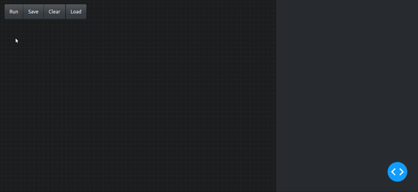
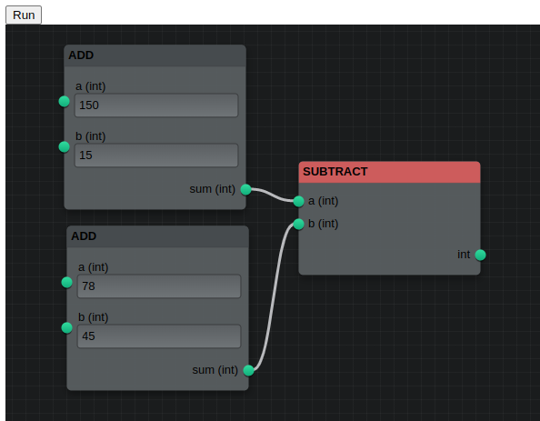

A node editor for [plotly dash](https://dash.plotly.com/)

Flowfunc is a plotly dash component which works as a web based node editor.
You can create nodes based on python functions and connect them together to define
the logic during runtime.

[Demo](https://najeem.pythonanywhere.com/)

[](https://najeem.pythonanywhere.com/)

The front end is created using the react package [Flume](https://flume.dev). The
data model is also heavily influenced by this package.
## Installation

**The package is still in alpha stage**. Please test out and let me know your
comments.

### Basic installation

```
pip install flowfunc
```

### Distributed
If you want to run your nodes using [rq](https://python-rq.org/) in a distributed
manner.
```
pip install flowfunc[distributed]
```

### Full installation

In addition to the packages required for distributed run, this will install dash as well.
```
pip install flowfunc[full]
```
## Basic Usage

A fully functioning dash app with Flowfunc node editor would look like below.
The app will have the node editor and a button to evaluate the current state of
the node editor. The result of the evaluation will be displayed in a separate `div`
at the bottom.

The nodes are created from regular python functions using it's function signature.
It is also possible to create a node manually which offers more control.

```python
from typing import Dict
import dash
from dash import html, Input, Output, State
from flowfunc import Flowfunc
from flowfunc.config import Config
from flowfunc.jobrunner import JobRunner
from flowfunc.models import OutNode

app = dash.Dash(__name__)

# Functions can be converted to nodes
def add(a: int, b: int) -> int:
    """Add two numbers"""
    return a + b

def subtract(a: int, b: int) -> int:
    """Find difference between two numbers"""
    return a - b


# A Config object contains info about the nodes and ports available in the node editor
nodeeditor_config = Config.from_function_list([add, subtract])

# A JobRunner object helps evaluate the nodes created using the node editor
runner = JobRunner(nodeeditor_config)

app.layout = html.Div(
    [
        html.Button(id="btn_run", children="Run"),
        Flowfunc(id="nodeeditor", config=nodeeditor_config.dict()),
        html.Div(id="output"),
    ], style={"height": "600px"}
)


@app.callback(
    Output("output", "children"),
    Input("btn_run", "n_clicks"),
    State("nodeeditor", "nodes"),
)
def run_nodes(nclicks: int, output_nodes: Dict[str, OutNode]):
    """Run the node layout"""
    # The result is a dictionary of OutNode objects
    result = runner.run(output_nodes)
    output = []
    for node in result.values():
        # node.result contains the result of the node
        output.append(
            html.Div([html.H1(f"{node.type}: {node.id}"), html.P(str(node.result))])
        )
    return output

if __name__ == "__main__":
    app.run() 
```

### Explanation

```python
nodeeditor_config = Config.from_function_list([add, subtract])
```
The `Flowfunc` component requires a `Config` object which contains the list of all
nodes as an input. You can create the list of nodes easily from a list of python
functions using the class method `from_function_list`. It will accept async
functions also.

```python
runner = JobRunner(nodeeditor_config)
...
result = runner.run(output_nodes)
```
`JobRunner` object helps evaluate the output of the front end node editor by making
sure the inputs and outputs are routed properly. It takes in the output from the
nodeeditor, parses it using pydantic and creates a dict of `OutNode` objects, evaluates
each of the objects by making sure the dependent inputs are routed properly.
It uses the functions defined in the config object to evaluate a node.
The output of `runner.run` is the same dictionary that it parsed initially, but
now with an addtional `result` attribute on each node. If you are running in
a distributed way, it will have a `job_id` attribute on every node. You can use
this `job_id` and the `queue` object to retrieve the results of the node.

```python
Flowfunc(id="nodeeditor", config=nodeeditor_config.dict())
```
This is the dash component with `id` equal to `nodeeditor`. You need to pass in
the config object created previously, but converted to a dictionary.

## More examples

Look into the examples folder to see a more elaborate example with better looking
interface using `dash-boostrap-components`. There is also an example which uses
the distributed method where each node is evaluated in a separate `rqworker`.

## Nodes

`Nodes` are the building blocks which you can connect together using their exposed
`Ports`. Flowfunc let's you easily create nodes from python functions by inspecting
their signature and type annotations. The parameters of the function becomes the
input ports and return value of the function becomes the output port. You can give
different types of type annotations. Even `dataclasses` and `pydantic` classes.
The parser does it's best to interpret the type annotations and render an 
equivalent node with different types of controls on it. If you aren't happy with
the controls that the parser creted, you can manually specify how the node should
be constructed.

Once the parser processed the function signature, it creates a
`Node` object which is a `pydantic` object.

## Ports
`Ports` are the inputs and outputs of a `Node`. So they basically mean the inputs
or outputs of a function. Ports can render controls in the node and let the user
interact with them and pass in data. There are some ports (read datatypes) which
come with a default control. They are `int`, `float`, `str`, `bool`, `color`,
`time`, `date`, `month`, `week`. Some of these are not standard python types and
hence, you cannot use them in type annotation directly. If you want to use type
annotation, create a custom type with these names. In future, the plan is to create
some kind of interface to make this process easier and also make more controls
available.

When you annotate a argument with a `dataclass` or `pydantic` object, `flowfunc`
will inspect the attributes of this class and it will try to create controls for
each of the attributes of the object. As of now, `flowfunc` cannot handle nested
`pydantic` or `dataclass` objects.

A default set of ports are automatically created when the nodes are processed
from python functions. `Port` object is also a pydantic object.

## Config
`Config` object holds info about all the nodes and ports available in the node
editor. It's a direct equivalent of [Flume](https://flume.dev)'s config object,
but modified so that the data can be serialized at the server side and sent to
the client (ie; no javascript functions). In future, the plan is to make it possible
to define functions in javascript as well.

`Config.nodes` will contain all the `Node` pydantic objects and `Config.ports`
will contain all the `Port` pydantic objects. 

## JobRunner
`JobRunner` object helps process the output of the node editor. `JobRunnber` can
run in as blocking (sync), return an awaitable (async), return a dict of rq
jobs (distributed) or await on a dict of rq jobs (async_distributed).

