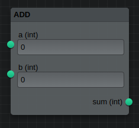

# DashFlume

A node editor for [plotly dash](https://dash.plotly.com/)

animation

The front end is created using the awesome react package [Flume](https://flume.dev). The
data model is also heavily influenced by this package.
## Installation

**The package is still in alpha stage**. Please test out and let me know your
comments.

### Basic installation

```
pip install dash_flume
```

### Distributed
If you want to run your nodes using [rq](https://python-rq.org/) in a distributed
manner.
```
pip install dash_flume[distributed]
```
## Basic Usage

A fully functioning dash app with DashFlume node editor would look like below.
The app will have the node editor and a button to evaluate the current state of
the node editor. The result of the evaluation will be displayed in a separate `div`
at the bottom.

The nodes are created from regular python functions with docstrings (the `add`
function in the following example). If docstrings are not found, the parser will
fall back to function signature (as in the `subtract` function).
It is also possible to create a node manually.

```python
from typing import Dict
import dash
from dash import html, Input, Output, State
from dash_flume import DashFlume
from dash_flume.config import Config
from dash_flume.jobrunner import JobRunner
from dash_flume.models import OutNode

app = dash.Dash(__name__)

# Functions can be converted to nodes
# Doc strings are parsed and converted to json which gets rendered at the front end
def add(a, b):
    """Add two numbers

    Parameters
    ----------
    a: int
        First number
    b: int
        Second number
    
    Returns
    -------
    sum: int
        Sum of a and b
    """
    return a + b

# If docstrings are not usable, it falls back to function signature and type annotations.
def subtract(a: int, b: int) -> int:
    """Find difference between two numbers"""
    return a - b


# A Config object contains info about the nodes and ports available in the node editor
nodeeditor_config = Config.from_function_list([add, subtract])

# A JobRunner object helps evaluate the nodes created using the node editor
runner = JobRunner(nodeeditor_config)

app.layout = html.Div(
    [
        html.Button(id="btn_run", children="Run"),
        DashFlume(id="nodeeditor", config=nodeeditor_config.config_dict()),
        html.Div(id="output"),
    ], style={"height": "600px"}
)


@app.callback(
    Output("output", "children"),
    Input("btn_run", "n_clicks"),
    State("nodeeditor", "nodes"),
)
def run_nodes(nclicks: int, output_nodes: Dict[str, OutNode]):
    """Run the node layout"""
    # The result is a dictionary of OutNode objects
    result = runner.run(output_nodes)
    output = []
    for node in result.values():
        # node.value contains the result of the node
        output.append(
            html.Div([html.H1(f"{node.type}: {node.id}"), html.P(str(node.value))])
        )
    return output

if __name__ == "__main__":
    app.run() 
```
## Nodes

`Nodes` are the building blocks which you can connect together using their exposed
`Ports`. DashFlume let's you easily create nodes from python functions by parsing
their docstrings. The parameters of the function becomes the input ports and
return value of the function becomes the output port. The docstring should document
the function description, the parameters it accepts and their type and also the
return name and type. If the parser encounters an error while parsing the docstring, it will fallback
to the function signature.

## Ports
`Ports` are the inputs and outputs of a `Node`. So they basically mean the inputs
or outputs of a function. Ports can render controls in the node and let the user
interact with them and pass in data. There are some ports (read datatypes) which
come with a default control. They are `int`, `float`, `str`, `bool`, `color`,
`time`, `date`, `month`, `week`. Some of these are not standard python types and
hence, you cannot use them in type annotation directly. If you want to use type
annotation, create a custom type with these names.


You can easily convert python functions in to the nodes of the node editor.

From this

```python
def add_numbers(a, b):
    """Add two numbers together

    Parameters
    ----------
    a: int
        First number
    b: int
        Second number
    
    Returns
    -------
    sum: int
        Sum of two numbers
    """
    return a + b
```

To this

image of add node



The parser relies on the docstring of the function to create the node.
If this method fails, it falls back to the function signature. For more control,
you can create the node manually, by setting each aspect of the node separately. Look into examples to know more.

This package uses the [Flume](https://flume.dev) react library for the front end.
## Creating a 

Get started with:
1. Install Dash and its dependencies: https://dash.plotly.com/installation
2. Run `python usage.py`
3. Visit http://localhost:8050 in your web browser

## Contributing

See [CONTRIBUTING.md](./CONTRIBUTING.md)

### Install dependencies

If you have selected install_dependencies during the prompt, you can skip this part.

1. Install npm packages
    ```
    $ npm install
    ```
2. Create a virtual env and activate.
    ```
    $ virtualenv venv
    $ . venv/bin/activate
    ```
    _Note: venv\Scripts\activate for windows_

3. Install python packages required to build components.
    ```
    $ pip install -r requirements.txt
    ```
4. Install the python packages for testing (optional)
    ```
    $ pip install -r tests/requirements.txt
    ```

### Write your component code in `src/lib/components/DashFlume.react.js`.

- The demo app is in `src/demo` and you will import your example component code into your demo app.
- Test your code in a Python environment:
    1. Build your code
        ```
        $ npm run build
        ```
    2. Run and modify the `usage.py` sample dash app:
        ```
        $ python usage.py
        ```
- Write tests for your component.
    - A sample test is available in `tests/test_usage.py`, it will load `usage.py` and you can then automate interactions with selenium.
    - Run the tests with `$ pytest tests`.
    - The Dash team uses these types of integration tests extensively. Browse the Dash component code on GitHub for more examples of testing (e.g. https://github.com/plotly/dash-core-components)
- Add custom styles to your component by putting your custom CSS files into your distribution folder (`dash_flume`).
    - Make sure that they are referenced in `MANIFEST.in` so that they get properly included when you're ready to publish your component.
    - Make sure the stylesheets are added to the `_css_dist` dict in `dash_flume/__init__.py` so dash will serve them automatically when the component suite is requested.
- [Review your code](./review_checklist.md)

### Create a production build and publish:

1. Build your code:
    ```
    $ npm run build
    ```
2. Create a Python distribution
    ```
    $ python setup.py sdist bdist_wheel
    ```
    This will create source and wheel distribution in the generated the `dist/` folder.
    See [PyPA](https://packaging.python.org/guides/distributing-packages-using-setuptools/#packaging-your-project)
    for more information.

3. Test your tarball by copying it into a new environment and installing it locally:
    ```
    $ pip install dash_flume-0.0.1.tar.gz
    ```

4. If it works, then you can publish the component to NPM and PyPI:
    1. Publish on PyPI
        ```
        $ twine upload dist/*
        ```
    2. Cleanup the dist folder (optional)
        ```
        $ rm -rf dist
        ```
    3. Publish on NPM (Optional if chosen False in `publish_on_npm`)
        ```
        $ npm publish
        ```
        _Publishing your component to NPM will make the JavaScript bundles available on the unpkg CDN. By default, Dash serves the component library's CSS and JS locally, but if you choose to publish the package to NPM you can set `serve_locally` to `False` and you may see faster load times._

5. Share your component with the community! https://community.plotly.com/c/dash
    1. Publish this repository to GitHub
    2. Tag your GitHub repository with the plotly-dash tag so that it appears here: https://github.com/topics/plotly-dash
    3. Create a post in the Dash community forum: https://community.plotly.com/c/dash
