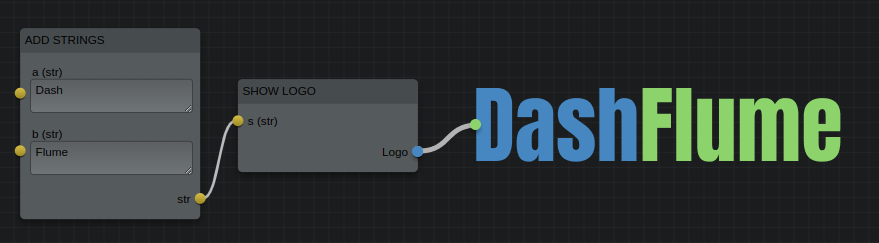

A node editor for [plotly dash](https://dash.plotly.com/)

DashFlume is a plotly dash component which works as a web based node editor.
You can create nodes based on python functions and connect them together to define
the logic during runtime.

animation

The front end is created using the react package [Flume](https://flume.dev). The
data model is also heavily influenced by this package.
## Installation

**The package is still in alpha stage**. Please test out and let me know your
comments.

### Basic installation

```
pip install dash_flume
```

### Distributed
If you want to run your nodes using [rq](https://python-rq.org/) in a distributed
manner.
```
pip install dash_flume[distributed]
```
## Basic Usage

A fully functioning dash app with DashFlume node editor would look like below.
The app will have the node editor and a button to evaluate the current state of
the node editor. The result of the evaluation will be displayed in a separate `div`
at the bottom.

The nodes are created from regular python functions with docstrings (the `add`
function in the following example). If docstrings are not found, the parser will
fall back to function signature (as in the `subtract` function).
It is also possible to create a node manually which offers more control.

```python
from typing import Dict
import dash
from dash import html, Input, Output, State
from dash_flume import DashFlume
from dash_flume.config import Config
from dash_flume.jobrunner import JobRunner
from dash_flume.models import OutNode

app = dash.Dash(__name__)

# Functions can be converted to nodes
# Doc strings are parsed and converted to json which gets rendered at the front end
def add(a, b):
    """Add two numbers

    Parameters
    ----------
    a: int
        First number
    b: int
        Second number
    
    Returns
    -------
    sum: int
        Sum of a and b
    """
    return a + b

# If docstrings are not usable, it falls back to function signature and type annotations.
def subtract(a: int, b: int) -> int:
    """Find difference between two numbers"""
    return a - b


# A Config object contains info about the nodes and ports available in the node editor
nodeeditor_config = Config.from_function_list([add, subtract])

# A JobRunner object helps evaluate the nodes created using the node editor
runner = JobRunner(nodeeditor_config)

app.layout = html.Div(
    [
        html.Button(id="btn_run", children="Run"),
        DashFlume(id="nodeeditor", config=nodeeditor_config.config_dict()),
        html.Div(id="output"),
    ], style={"height": "600px"}
)


@app.callback(
    Output("output", "children"),
    Input("btn_run", "n_clicks"),
    State("nodeeditor", "nodes"),
)
def run_nodes(nclicks: int, output_nodes: Dict[str, OutNode]):
    """Run the node layout"""
    # The result is a dictionary of OutNode objects
    result = runner.run(output_nodes)
    output = []
    for node in result.values():
        # node.value contains the result of the node
        output.append(
            html.Div([html.H1(f"{node.type}: {node.id}"), html.P(str(node.result))])
        )
    return output

if __name__ == "__main__":
    app.run() 
```

### Explanation

```python
nodeeditor_config = Config.from_function_list([add, subtract])
```
The `DashFlume` component requires a `Config` object which contains the list of all
nodes as an input. You can create the list of nodes easily from a list of python
functions using the class method `from_function_list`. It will accept async
functions also.

```python
runner = JobRunner(nodeeditor_config)
...
result = runner.run(output_nodes)
```
`JobRunner` object helps evaluate the output of the front end node editor by making
sure the inputs and outputs are routed properly. It returns a dictionary of `OutNode`
objects which has a `result` attribute which contains the return object of the
python function associated with the node.

```python
DashFlume(id="nodeeditor", config=nodeeditor_config.config_dict())
```
This is the dash component with `id` equal to `nodeeditor`. You need to pass in
the config object created previously, but converted to a dictionary.

## Nodes

`Nodes` are the building blocks which you can connect together using their exposed
`Ports`. DashFlume let's you easily create nodes from python functions by parsing
their docstrings. The parameters of the function becomes the input ports and
return value of the function becomes the output port. The docstring should document
the function description, the parameters it accepts and their type and also the
return name and type. If the parser encounters an error while parsing the docstring,
it will fallback to the function signature.

Once the parser processes the docstring or the function signature, it creates a
`Node` object which is a `pydantic` object.

## Ports
`Ports` are the inputs and outputs of a `Node`. So they basically mean the inputs
or outputs of a function. Ports can render controls in the node and let the user
interact with them and pass in data. There are some ports (read datatypes) which
come with a default control. They are `int`, `float`, `str`, `bool`, `color`,
`time`, `date`, `month`, `week`. Some of these are not standard python types and
hence, you cannot use them in type annotation directly. If you want to use type
annotation, create a custom type with these names.

A default set of ports are automatically created when the nodes are processed
from python functions. `Port` object is also a pydantic object.

## Config
`Config` object holds info about all the nodes and ports available in the node
editor. It's a direct equivalent of [Flume](https://flume.dev)'s config object,
but modified so that the data can be serialized at the server side and sent to
the client (ie; no javascript functions). In future, the plan is to make it possible
to define functions in javascript as well.

`Config.nodes` will contain all the `Node` pydantic objects and `Config.ports`
will contain all the `Port` pydantic objects. 

## JobRunner
`JobRunner` object helps process the output of the node editor.


.... documentation in progress.